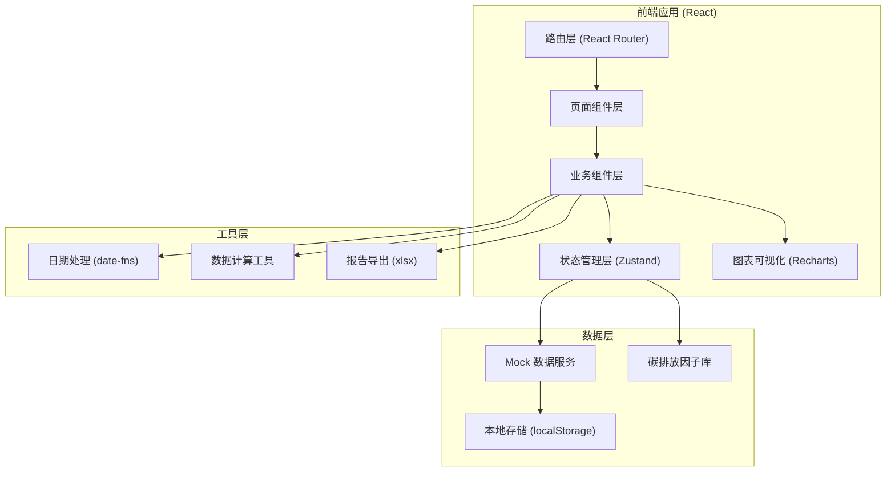
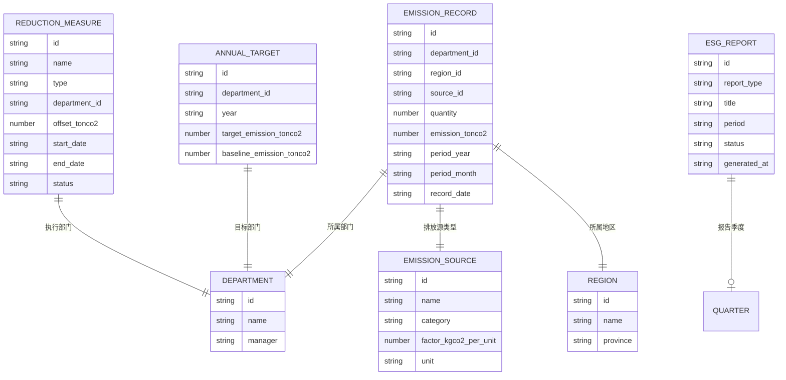

## 1. 架构设计



## 2. 技术描述

- **前端框架**: React@18 + TypeScript
- **构建工具**: Vite@5
- **样式方案**: TailwindCSS@3 + PostCSS
- **状态管理**: Zustand（轻量级状态管理）
- **路由**: React Router Dom@6
- **图表库**: Recharts（React生态图表方案）
- **图标库**: Lucide React
- **工具库**: date-fns（日期处理）、xlsx（Excel导出）
- **后端方案**: 无后端，使用 Mock 数据 + localStorage 持久化
- **代码规范**: ESLint + Prettier

## 3. 路由定义

| 路由路径 | 页面名称 | 说明 |
|----------|----------|------|
| / | 数据总览仪表盘 | 核心指标、目标进度、排放结构、趋势分析 |
| /data-entry | 碳排放数据录入 | 排放数据录入、列表管理、批量导入 |
| /targets | 减排目标管理 | 年度目标设置、部门分解目标、进度追踪 |
| /analysis | 排放结构分析 | 多维度筛选、分类图表、主要排放源识别 |
| /measures | 减排措施管理 | 减排项目录入、抵消量扣减、净排放计算 |
| /reports | ESG报告中心 | 季度摘要、年度报告、GRI/CDP框架导出 |
| /history | 历史数据对比 | 年度趋势分析、同比环比对比 |

## 4. 数据模型

### 4.1 数据模型定义



### 4.2 碳排放因子参考数据

| 排放源类别 | 具体项目 | 单位 | 碳排放因子 (kgCO₂e/单位) |
|-----------|---------|------|------------------------|
| 能源消耗 | 电力 | kWh | 0.5810 |
| 能源消耗 | 天然气 | m³ | 2.1622 |
| 能源消耗 | 汽油 | L | 2.2900 |
| 能源消耗 | 柴油 | L | 2.6300 |
| 差旅交通 | 航空-国内 | km | 0.2550 |
| 差旅交通 | 航空-国际 | km | 0.1860 |
| 差旅交通 | 铁路 | km | 0.0410 |
| 差旅交通 | 公路-客车 | km | 0.0890 |
| 办公耗材 | 纸张-A4 | 包 | 3.3000 |
| 办公耗材 | 墨盒 | 个 | 0.5000 |
| 废弃物处理 | 一般垃圾 | kg | 0.4200 |
| 废弃物处理 | 可回收物 | kg | 0.1000 |

## 5. 核心业务计算逻辑

### 5.1 碳排放换算
```
碳排放量(吨CO₂e) = 活动数据 × 碳排放因子 ÷ 1000
```

### 5.2 净排放计算
```
净排放量 = 总排放量 - 减排抵消量
```

### 5.3 目标完成率
```
目标完成率 = (目标基准排放 - 实际净排放) / (目标基准排放 - 目标排放) × 100%
```

### 5.4 同比变化率
```
同比变化率 = (本期排放 - 上年同期排放) / 上年同期排放 × 100%
```

## 6. 项目目录结构

```
src/
├── assets/           # 静态资源
├── components/       # 通用业务组件
│   ├── charts/       # 图表组件
│   ├── layout/       # 布局组件
│   └── ui/           # 基础UI组件
├── data/             # Mock数据与常量
│   ├── mock/         # Mock数据
│   └── factors.ts    # 碳排放因子库
├── pages/            # 页面组件
├── store/            # Zustand状态管理
├── types/            # TypeScript类型定义
├── utils/            # 工具函数
│   ├── calculator.ts # 排放计算工具
│   ├── export.ts     # 报告导出工具
│   └── format.ts     # 格式化工具
├── App.tsx
├── main.tsx
└── index.css
```
