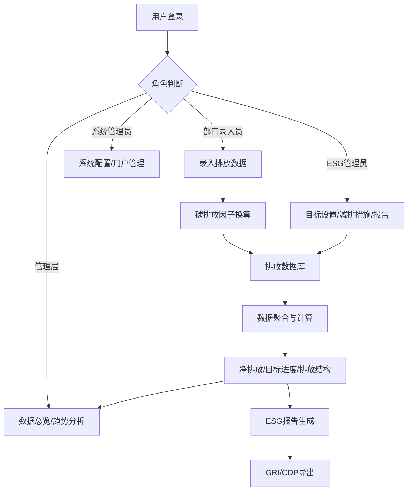

## 1. 产品概述

企业碳排放追踪与ESG报告平台是一套面向企业可持续发展管理的数字化解决方案，帮助企业集中管理各部门碳排放数据、追踪减排目标、分析排放结构并自动生成符合国际标准的ESG报告。

- 解决企业碳排放数据分散、人工核算效率低、ESG报告编制成本高的痛点
- 为企业管理层提供数据驱动的减排决策依据，满足监管合规与对外披露需求

## 2. 核心功能

### 2.1 用户角色

| 角色 | 说明 | 核心权限 |
|------|------|----------|
| 系统管理员 | 平台管理与配置 | 用户管理、部门配置、碳排放因子维护、系统设置 |
| 部门录入员 | 各部门数据录入人员 | 录入本部门排放数据、查看本部门统计 |
| ESG管理员 | ESG报告编制人员 | 全量数据查看、减排措施管理、目标设置、报告生成与导出 |
| 管理层 | 企业决策人员 | 全局数据总览、趋势分析、目标进度查看 |

### 2.2 功能模块

1. **数据总览仪表盘**：核心指标卡片、目标进度环、排放结构图表、趋势折线图
2. **碳排放数据录入**：多维度数据录入表单、批量导入、数据校验
3. **减排目标管理**：年度目标设置、实时进度追踪、部门分解目标
4. **排放结构分析**：按部门/地区/排放源分类统计、主要排放源识别
5. **减排措施管理**：减排项目录入、抵消量扣减、净排放计算
6. **ESG报告中心**：季度摘要自动生成、年度完整报告、GRI/CDP框架导出
7. **历史数据对比**：年度趋势分析、同比环比对比

### 2.3 页面详情

| 页面名称 | 模块名称 | 功能描述 |
|----------|----------|----------|
| 数据总览仪表盘 | 核心指标卡片 | 显示年度总排放、净排放、目标完成率、较去年同期变化 |
| 数据总览仪表盘 | 目标进度环 | 可视化展示当前排放与年度目标的对比进度 |
| 数据总览仪表盘 | 排放结构饼图 | 按排放源分类展示碳排放占比 |
| 数据总览仪表盘 | 趋势折线图 | 展示近12个月排放趋势，支持同比对比 |
| 数据总览仪表盘 | 部门排放排行 | Top 5排放部门柱状图 |
| 碳排放数据录入 | 数据录入表单 | 支持用电量、天然气、差旅里程、办公耗材等多类型数据录入 |
| 碳排放数据录入 | 数据列表 | 历史录入数据的查看、编辑、删除 |
| 碳排放数据录入 | 批量导入 | Excel模板下载与批量数据导入 |
| 减排目标管理 | 目标设置 | 设置企业年度减排目标、各部门分解目标 |
| 减排目标管理 | 进度追踪 | 实时展示各目标完成情况、预警提醒 |
| 排放结构分析 | 多维度筛选 | 按时间、部门、地区、排放源筛选数据 |
| 排放结构分析 | 分类图表 | 部门维度柱状图、地区维度地图/饼图、排放源维度堆叠图 |
| 减排措施管理 | 措施录入 | 录入购买绿电、植树造林、碳汇购买等减排措施 |
| 减排措施管理 | 抵消计算 | 自动扣减抵消量、计算净排放量 |
| ESG报告中心 | 季度摘要 | 自动生成季度ESG数据摘要卡片 |
| ESG报告中心 | 年度报告 | 生成完整年度ESG报告，支持在线预览 |
| ESG报告中心 | 框架导出 | 支持GRI、CDP标准格式Excel/PDF导出 |
| 历史数据对比 | 年度对比 | 多年度排放数据柱状图对比 |
| 历史数据对比 | 趋势分析 | 排放趋势线、减排速率分析 |

## 3. 核心流程

用户登录系统后，根据角色权限进入不同功能模块。部门录入员定期录入排放数据，系统自动通过碳排放因子换算为CO₂当量；ESG管理员设置年度减排目标并录入减排措施，系统实时计算净排放与目标进度；管理层通过仪表盘查看全局数据与趋势分析；每季度/年末系统自动汇总数据生成ESG报告，支持按国际标准框架导出。

## 4. 用户界面设计

### 4.1 设计风格
- **主色调**：深森林绿 #1B4332（代表自然与可持续），辅以翠绿 #2D6A4F、薄荷绿 #52B788
- **强调色**：暖琥珀色 #D4A373（用于数据高亮与警示）
- **中性色**：象牙白 #FEFAE0 背景、深灰 #264653 文字
- **按钮风格**：圆角8px，主按钮实色填充带微阴影，悬停有轻微上浮动效
- **字体**：标题使用 Playfair Display（优雅衬线），正文使用 Lora（高可读性衬线）
- **布局风格**：卡片式布局，卡片带柔和阴影与圆角，留白充裕，顶部导航栏
- **图标风格**：线性图标，使用 Lucide React 图标库，保持统一粗细

### 4.2 页面设计概述

| 页面名称 | 模块名称 | UI元素 |
|----------|----------|----------|
| 数据总览仪表盘 | 核心指标卡片 | 渐变底色卡片、大字号数据、趋势箭头、淡入动画 |
| 数据总览仪表盘 | 目标进度环 | SVG环形进度条、中央百分比、呼吸光晕动效 |
| 数据总览仪表盘 | 排放结构饼图 | 交互式环形图、悬停显示详情、色块与主色调统一 |
| 数据总览仪表盘 | 趋势折线图 | 平滑曲线、面积渐变填充、数据点悬停提示 |
| 碳排放数据录入 | 数据录入表单 | 分步表单、绿色进度指示器、输入框焦点高亮 |
| ESG报告中心 | 报告卡片 | 文档卡片样式、状态标签、导出按钮组 |
| 减排目标管理 | 进度卡片 | 部门横向进度条、达标状态颜色标识 |

### 4.3 响应式
- 桌面端优先设计（1440px基准）
- 平板端（768px-1024px）：卡片自适应换行，侧边栏收起为汉堡菜单
- 移动端（<768px）：单列布局，图表简化展示，表格支持横向滚动

### 4.4 动效设计
- 页面加载：卡片自上而下交错淡入（staggered fade-in）
- 数据更新：数字滚动动画（count-up）
- 图表：柱状图从底部生长、折线图路径绘制动画
- 悬停交互：卡片轻微上浮+阴影加深、按钮背景色渐变过渡
